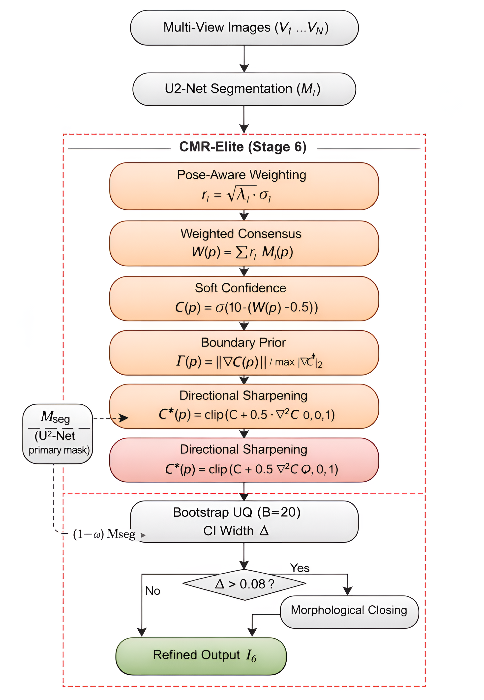
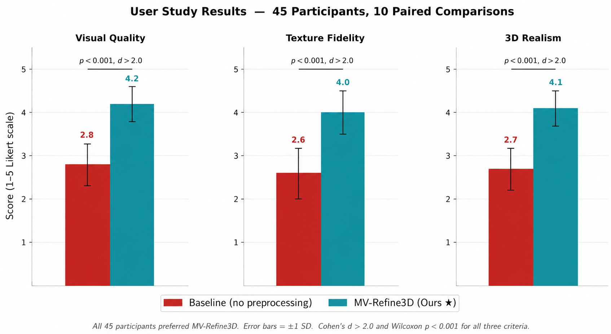

# MV-Refine3D

**Multi-Stage Preprocessing Framework for Enhanced 3D Garment Reconstruction from Virtual Try-On Outputs**

> Paper under review at Multimedia Tools and Applications (Springer)

---

## Repository Status

Initial public research repository for manuscript review and reproducibility support.

---






---

## Overview

MV-Refine3D bridges the domain gap between 2D virtual try-on outputs and 
high-fidelity 3D garment reconstruction. The key insight is that reconstruction 
quality is bottlenecked not by the 3D backbone, but by cross-view silhouette 
inconsistency — resolvable before reconstruction without any architectural modification.

---

## Pipeline (8 Stages)

| Stage | Component | Purpose |
|-------|-----------|---------|
| 1 | Face Restoration (GFPGAN) | Removes facial artefacts |
| 2 | Texture Enhancement (Real-ESRGAN) | Restores garment detail |
| 3 | Background Removal (U2-Net) | Eliminates background clutter |
| 4 | Pose Alignment | Centres subject for view synthesis |
| 5 | Multi-View Synthesis (Zero123++) | Generates 6 calibrated views |
| 6 | CMR-Elite Silhouette Aggregation | Uncertainty-aware cross-view consistency |
| 7 | Edge Crispening | Sharpens silhouette boundaries |
| 8 | Resolution Upscaling (1024×1024) | Prepares reconstruction-ready input |

---

## Key Contribution: CMR-Elite

Uncertainty-Aware Confidence-Weighted Multi-View Silhouette Aggregation via:
- Pose-aware reliability weighting
- Self-supervised gradient-magnitude boundary prior
- Directional entropy-guided sharpening
- Bootstrap uncertainty quantification (B=20) with adaptive correction

---

## Results

| Metric | Improvement |
|--------|------------|
| Mesh Width | +30.3% |
| Mesh Depth | +23.5% |
| Chamfer Distance | −49.5% |
| Normal Consistency | +14.2% |
| PSNR | 29.65 dB |
| User Study (Cohen's d) | >2.0 (p<0.001, n=45) |

Evaluated on 500 images across 4 benchmarks: Self-collected, VITON-HD, DressCode, DeepFashion.

---

## Code

This repository currently contains project information and documentation.
Implementation code will be released upon acceptance.

---

## Citation

```bibtex
@article{ganeshak2026mvrefine3d,
  title={MV-Refine3D: A Multi-Stage Preprocessing Framework for Enhanced 
         3D Garment Reconstruction from Virtual Try-On Outputs},
  author={Ganesha K},
  journal={Multimedia Tools and Applications},
  year={2026}
}
```

---

## Acknowledgements

This work builds on: FitDiT, Hunyuan3D, Zero123++, GFPGAN, Real-ESRGAN, and U2-Net.
